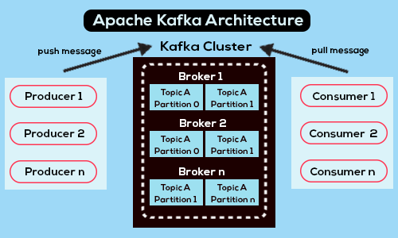

# Kafka là gì ?
- Apache Kafka là một nền tảng phân phối dữ liệu mã nguồn mở được thiết kế để xử lý các luồng dữ liệu lớn và tốc độ cao. Kafka được thiết kế để xử lý các luồng dữ liệu từ nhiều nguồn khác nhau và cung cấp cho phép các ứng dụng có thể truy cập dữ liệu trong Kafka bất cứ lúc nào.

# Tác dụng của Kafka ?
- Publish và subscribe các stream của record (luồng dữ liệu).
- Khả năng lưu trữ các stream of record một cách hiệu theo thứ tự các record được tạo. 
- Khả năng xử lý stream of record theo thời gian thực.
- Khả năng mở rộng: mô hình phân vùng nhật ký của Kafka cho phép dữ liệu của bạn có thể phân phối trên nhiều máy chủ và giúp bạn có thể mở rộng máy chủ khi không còn phù hợp.

# Khi nào nên sử dụng Kafka ?
- Xử lý dữ liệu lớn.
- Nhanh: Với cách xử lý tách các luồng dữ liệu, vì thế độ trễ rất thấp làm cho tốc độ trở nên nhanh hơn.
- Khả năng chịu lỗi và độ bền: Các gói dữ liệu của bạn có thể được sao chép và phân phối trên nhiều server khác nhau. Vì thế, khi có một sự cố xảy ra, dữ liệu của bạn ít bị lỗi hơn và bền hơn.

# Kafka flow

# Các khái niệm:
1. Producer: Ứng dụng này để gửi dữ liệu(message record) cho Kafka server.
2. Consumer: Ứng dụng này để nhận dữ liệu(message record) từ Kafka server.
3. Cluster: Kafka là 1 hệ thống phân tán, mỗi cluster sẽ như 1 cái máy tính hoạt động trong hệ thống đấy.
4. Broker: Là tên gọi của Kafka server, như là 1 máy chủ trung gian cho việc gửi nhận dữ liệu của producer và consumer.
5. Kafka Topic: Broker sẽ chia thành các topic nhỏ hơn phục vụ cho việc gửi và nhận dữ liệu nhanh hơn.
6. Topic partion: Khi dữ liệu lớn thì cần phải chia thành các partion để chia nhỏ dữ liệu ra, trong mỗi partion có thể chia nhỏ thành các offset. Offset là một số nguyên duy nhất đại diện cho vị trí của một thông điệp trong một partition của một topic. Offset được sử dụng để đánh dấu tiến trình tiêu thụ đã đọc đến đâu trong partition. Mỗi partition trong một topic có một offset riêng, vì vậy các tiến trình tiêu thụ có thể đọc các thông điệp trong một partition một cách độc lập và không gây xung đột với nhau.
7. Consumer group: Hệ thống sẽ chia nho dữ liệu cho các consumer thuộc cùng 1 group để dễ xử lý dữ liệu hơn.
8. Kafka connect: Là 1 hế thống giúp cho việc kết nối kafka với hệ thống khác.
9. Kafka Streams: là một thư viện được xây dựng trên Apache Kafka, cho phép các ứng dụng xử lý dữ liệu trực tiếp trên Kafka.
10. KSQL: là một công cụ truy vấn mã nguồn mở được xây dựng trên Apache Kafka. Nó cho phép người dùng truy vấn và xử lý dữ liệu trực tiếp trên Kafka bằng cách sử dụng câu lệnh SQL truyền thống, giúp giảm đáng kể thời gian lập trình và tăng tính linh hoạt của các ứng dụng xử lý dữ liệu.

# Các lệnh chạy kafka serve
1. C:\kafka>.\bin\windows\zookeeper-server-start.bat .\config\zookeeper.properties
2. C:\kafka>.\bin\windows\kafka-server-start.bat .\config\server.properties
3. Tạo mới topic: C:\kafka>.\bin\windows\kafka-topics.bat --create --topic test-topic --bootstrap-server localhost:9092 --replication-factor 1 --partitions 4

